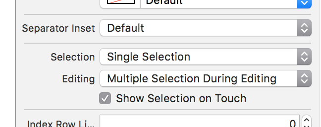
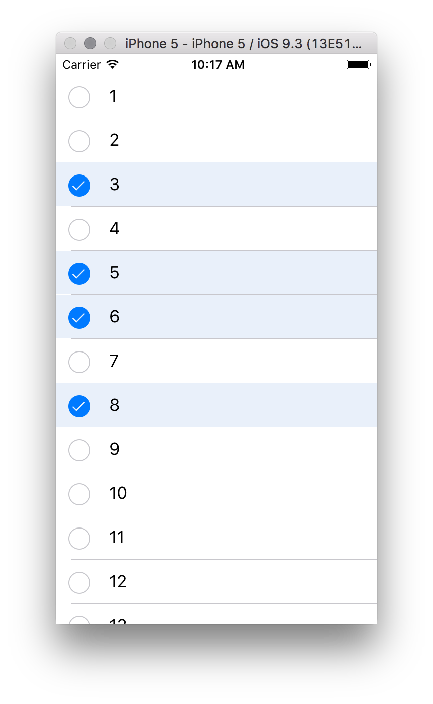

# tableViewMultipleSelection
Shows how to do multiple selection in a table view with built in checkmarks. 

Just set your table view to `editing = true`
and configure your tableView to allow Multiple Selection During Editing.

